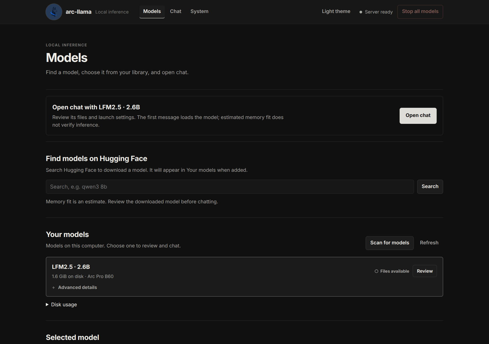
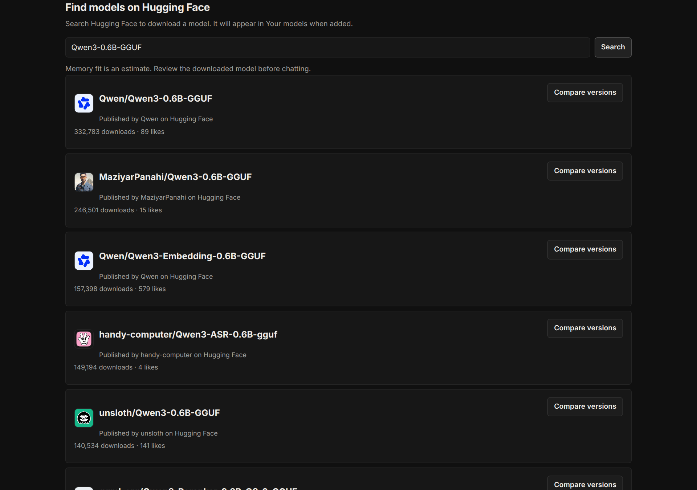
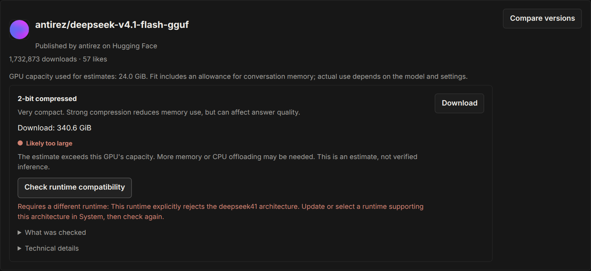
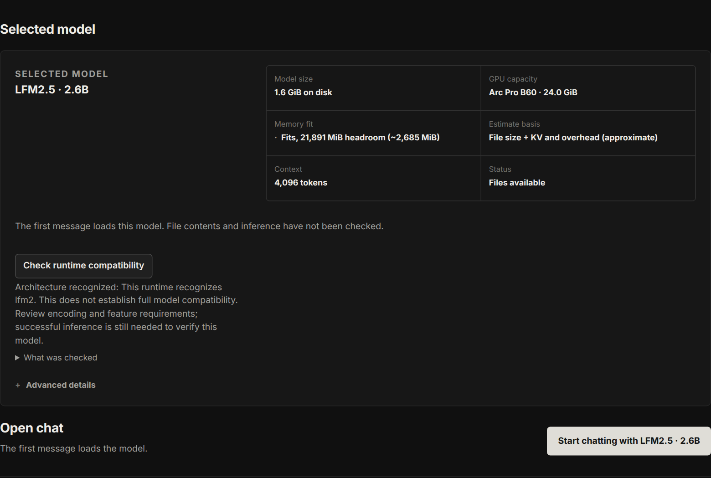
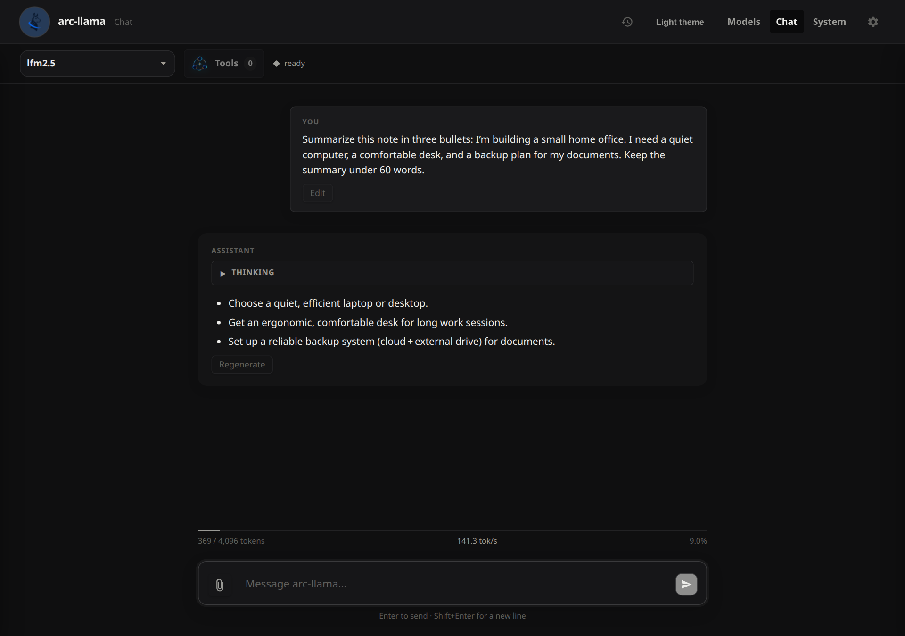
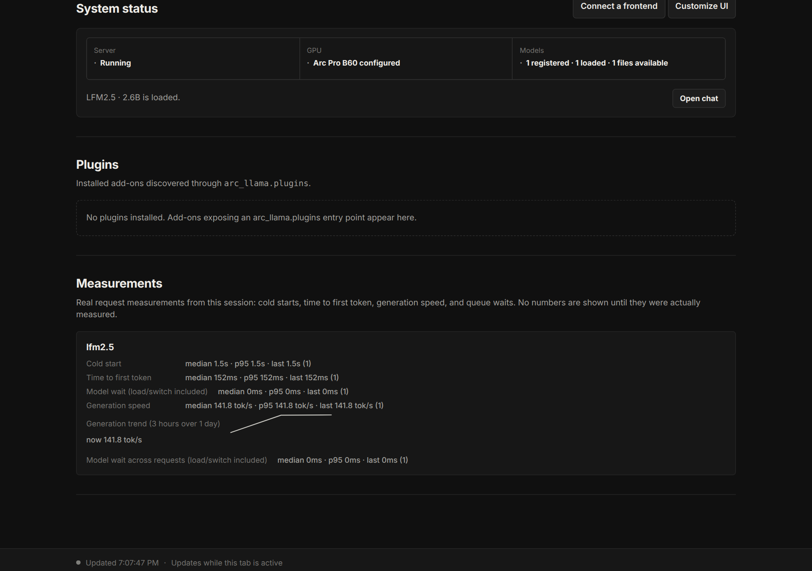

# A quick look at Arc Llama

A six-screen walkthrough of the interface included in Arc Llama 0.9.1.2.
These are actual app captures on an Intel Arc Pro B60, using an isolated example
configuration and a real local LFM2.5 conversation. No personal history is included.

**[Start the click-through tour →](01-models.md)**

| [Models](01-models.md) | [Discover](02-discover.md) | [Compatibility](03-compatibility.md) |
| --- | --- | --- |
|  |  |  |

| [Review](04-review.md) | [Chat](05-chat.md) | [System](06-system.md) |
| --- | --- | --- |
|  |  |  |

## Swipeable gallery

[index.html](index.html) is the same tour with thumbnails, arrows, keyboard controls,
and mobile swipe navigation. Open it locally with the adjacent `images/` folder,
or serve this folder as a static site. GitHub's file view does not execute HTML.
The gallery needs no framework, installation, external fonts, or API connection.
With JavaScript disabled, all six screenshots remain visible.

The repository README links to Markdown slides so visitors can click through on
GitHub without hosting anything. Publishing a swipeable version with GitHub Pages
is a separate deployment step; no deployment is configured by this change.

## Capture notes

- Captured from the app on 2026-10-10. Publisher names, search results, and the
  compatibility rejection came from real Hugging Face responses.
- The DeepSeek V4.1 example demonstrates an architecture rejection independently
  of its memory-fit warning. Recognition alone does not verify encoding or inference.
- The LFM2.5 chat was generated locally. Its System measurements describe this
  short example, not a performance comparison or supported-hardware guarantee.
- The example used a temporary configuration, state directory, and router port.
  All screenshot-generation processes were stopped after capture.
- Regenerate the screenshots when visible features change. Keep account tokens,
  personal conversations, and private file paths out of published images.
